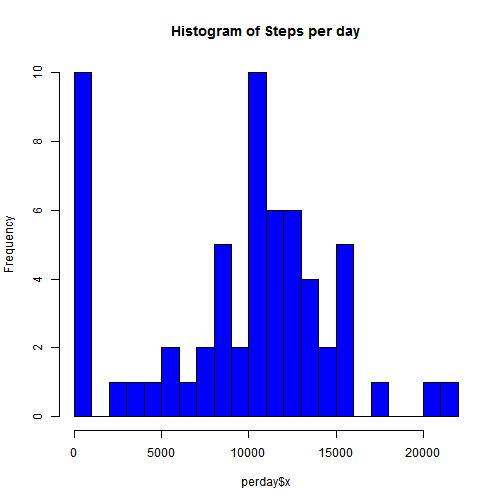
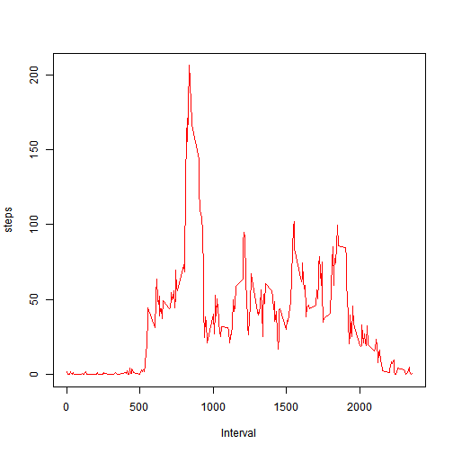
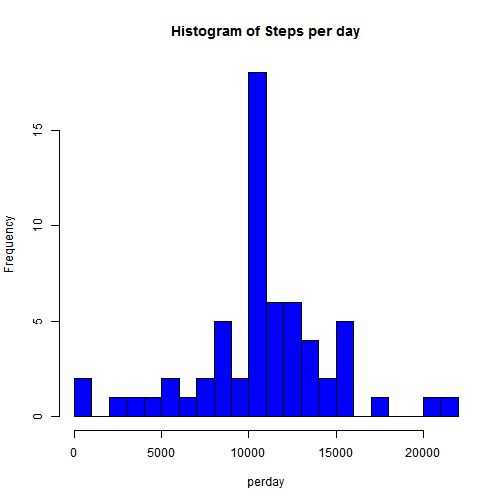
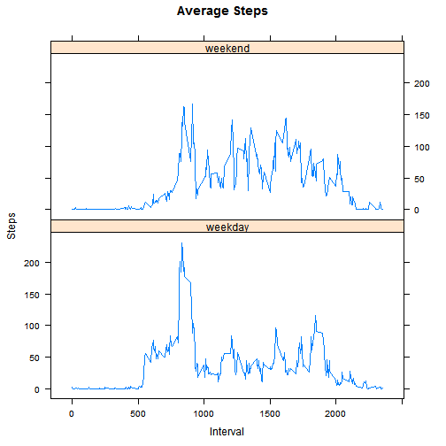

```r
---
title: "Assignment Week 2"
output: html_document
---
```

```
## Error: <text>:6:0: unexpected end of input
## 4: ---
## 5: 
##   ^
```


## Loading and preprocessing the data

This is the R Markdown document for the assigment of week 2 of course 5. First read the csv file and then the date format is changed

```r
#setwd("C:/Users/nvandersteen/Documents/Data Scientist Johns Hopkins/Course 5/Week 2")
data <- read.csv(file ="activity.csv", header = TRUE, sep = ",", na.strings = "NA" , stringsAsFactors = FALSE)
data$date <-as.Date(data$date)
head(data)
```

```
##   steps       date interval
## 1    NA 2012-10-01        0
## 2    NA 2012-10-01        5
## 3    NA 2012-10-01       10
## 4    NA 2012-10-01       15
## 5    NA 2012-10-01       20
## 6    NA 2012-10-01       25
```
## What is mean total number of steps taken per day?

A histogram of the total number of steps taken each day


```r
perday <- aggregate(data$steps, by = list(data$date), FUN =sum, na.rm=TRUE)
hist(perday$x, breaks = 20, col = "blue", main = "Histogram of Steps per day")
```



Calculate and report the mean and median total number of steps taken per day


```r
mean(perday$x, na.rm = TRUE) 
```

```
## [1] 9354.23
```

```r
median(perday$x, na.rm = TRUE)
```

```
## [1] 10395
```

## What is the average daily activity pattern?

Make a time series plot (i.e. type = "l") of the 5-minute interval (x-axis) and the average number of steps taken, averaged across all days (y-axis)


```r
perinterval <- aggregate(data$steps, by = list(data$interval), FUN =mean, na.rm=TRUE)
plot(perinterval$Group.1,perinterval$x , type="l", xlab="Interval", ylab= "steps" , col = "red")
```



Which 5-minute interval, on average across all the days in the dataset, contains the maximum number of steps?


```r
max(perinterval$x )
```

```
## [1] 206.1698
```

## Imputing missing values

Calculate and report the total number of missing values in the dataset (i.e. the total number of rows with NAs)

```r
sum(rowSums(is.na(data)))
```

```
## [1] 2304
```

Devise a strategy for filling in all of the missing values in the dataset. The strategy does not need to be sophisticated. For example, you could use the mean/median for that day, or the mean for that 5-minute interval, etc.
First the row with NA's are selected, then the samen mean as created before are used to fill in the NA's


```r
nas <- is.na(data$steps)
perinterval <- tapply(data$steps, data$interval, FUN =mean, na.rm=TRUE)
data$steps[nas] <- perinterval[as.character(data$interval[nas])]
```

Make a histogram of the total number of steps taken each day and Calculate and report the mean and median total number of steps taken per day. Do these values differ from the estimates from the first part of the assignment? What is the impact of imputing missing data on the estimates of the total daily number of steps?


```r
perday <- tapply(data$steps, data$date, FUN =sum, na.rm=TRUE)
hist(perday, breaks = 20, col = "blue", main = "Histogram of Steps per day")
```



Calculate and report the mean and median total number of steps taken per day


```r
mean(perday, na.rm = TRUE) 
```

```
## [1] 10766.19
```

```r
median(perday, na.rm = TRUE)
```

```
## [1] 10766.19
```
The mean and median become the same.

##Are there differences in activity patterns between weekdays and weekends?

For this part the weekdays() function may be of some help here. Use the dataset with the filled-in missing values for this part.

Create a new factor variable in the dataset with two levels -- "weekday" and "weekend" indicating whether a given date is a weekday or weekend day.


```r
data$weektype <- ifelse(weekdays(data$date) == "zaterdag" | weekdays(data$date) == "zondag", "weekend", "weekday")
```

Make a panel plot containing a time series plot (i.e. type = "l") of the 5-minute interval (x-axis) and the average number of steps taken, averaged across all weekday days or weekend days (y-axis). The plot should look something like the following, which was created using simulated data:


```r
steps_by_date <- aggregate(steps ~ interval + weektype, data, mean)
library(lattice)

xyplot(steps_by_date$steps ~ steps_by_date$interval|steps_by_date$weekty, main="Average Steps",xlab="Interval", ylab="Steps",layout=c(1,2), type="l")
```


```

